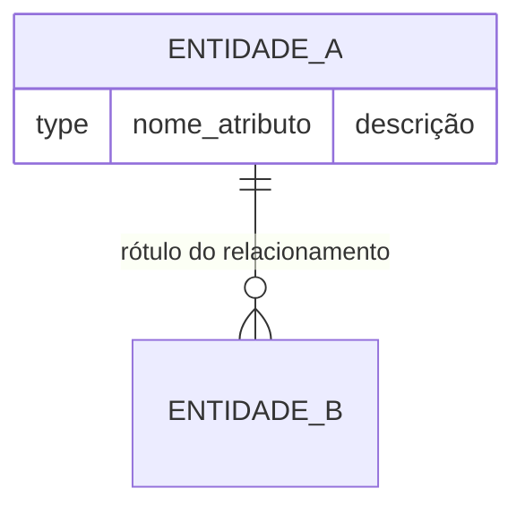

# DER: {WORK_ITEM_TITLE}

## Diagrama

## Glossário de Entidades

| Entidade | Descrição | Atributos documentados | Fonte |
|----------|-----------|------------------------|-------|
| ... | ... | ... | [[entities/...]] |

## Relacionamentos Confirmados

| Relacionamento | Cardinalidade | Rótulo | Fonte |
|----------------|--------------|--------|-------|
| ... | ... | ... | [[entities/...]] |

## Relacionamentos Inferidos

| Relacionamento | Cardinalidade | Evidência | Fonte |
|----------------|--------------|-----------|-------|
| ... | ... | ... | [[sources/...]] |

## Lacunas

> [!gap] ...

## Questões Abertas

- [ ] ...

## Fontes

- [[overview]]
- [[entities/...]]
- [[concepts/...]]
- [[sources/...]]
