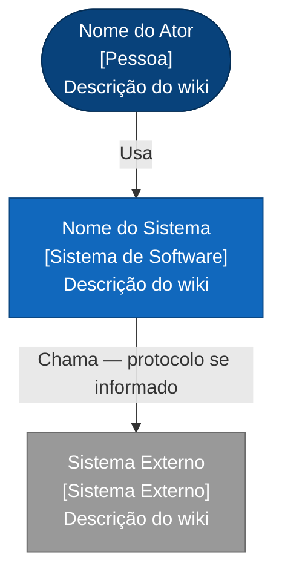
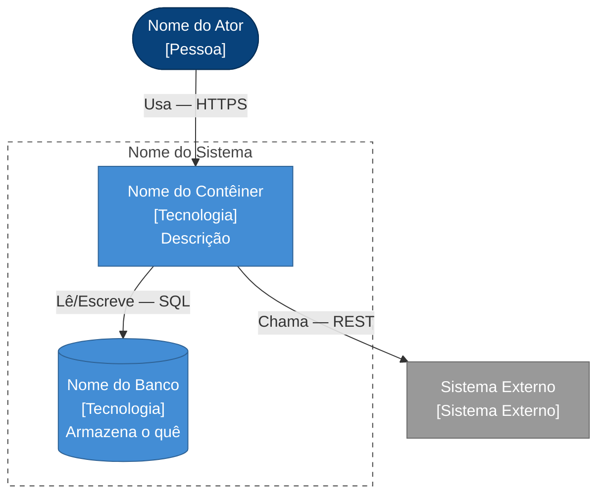
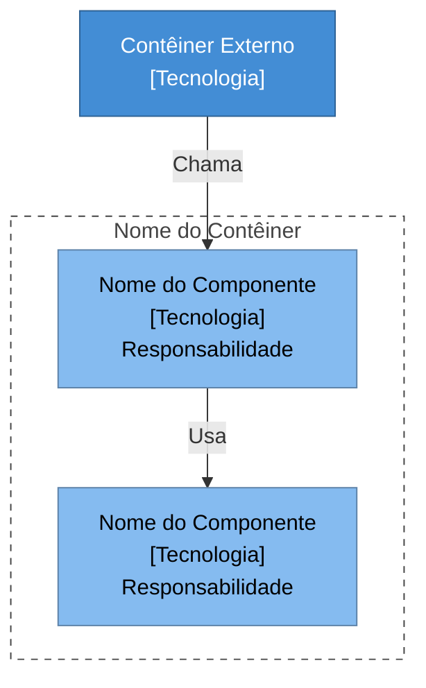
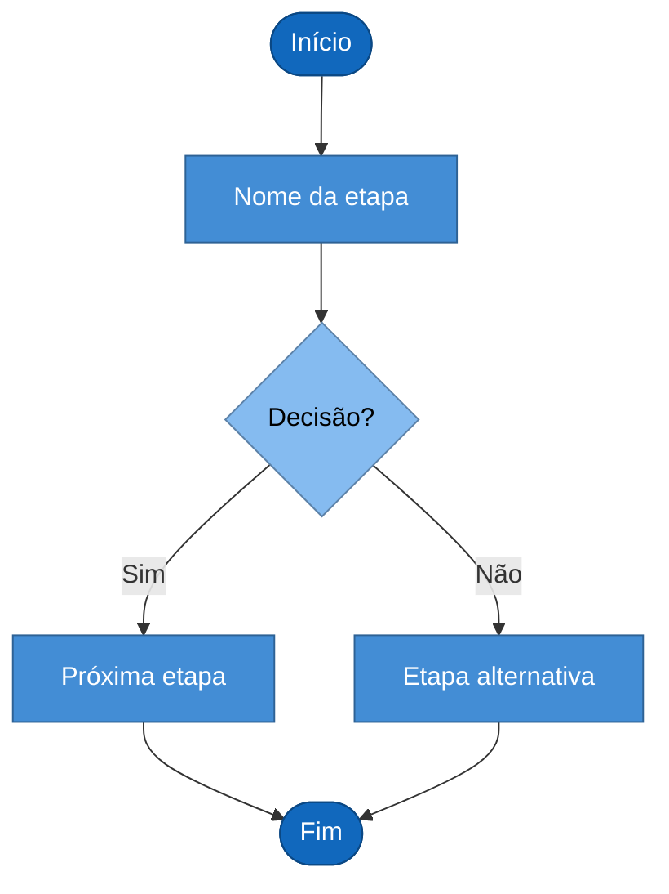
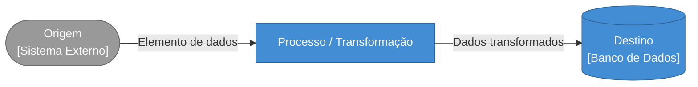
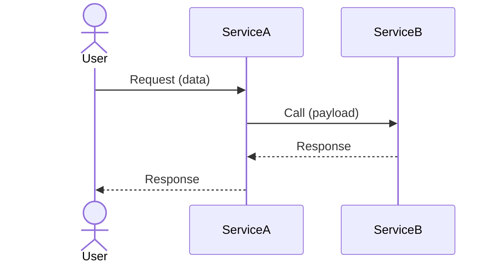
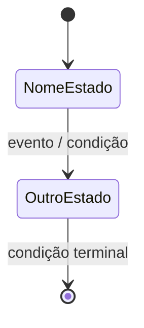

# Templates de Diagrama (PT-BR)

Use a seção correspondente ao `{DIAGRAM_TYPE}`.

---

> **Convenções de cor C4Model** — inclua as linhas `classDef` relevantes em todo diagrama flowchart:
>
> | Classe | Elemento | Preenchimento |
> |---|---|---|
> | `person` | Atores humanos / usuários | `#08427B` (azul escuro) |
> | `system` | Sistemas de software internos | `#1168BD` (azul) |
> | `external` | Sistemas externos / terceiros | `#999999` (cinza) |
> | `container` | Apps, serviços, filas dentro de um sistema | `#438DD5` (azul médio) |
> | `database` | Bancos de dados / armazenamento | `#438DD5` (azul médio) |
> | `component` | Componentes dentro de um contêiner | `#85BBF0` (azul claro, texto escuro) |
> | `step` | Etapas de processo | `#438DD5` (azul médio) |
> | `decision` | Nós de decisão / ramificação | `#85BBF0` (azul claro, texto escuro) |
> | `terminal` | Nós de início / fim | `#1168BD` (azul) |

---

## c4-context

````markdown
---
title: "C4 N1 Contexto do Sistema — {WORK_ITEM_TITLE}"
type: artifact
subtype: diagram
diagram_type: c4-context
hierarchy_level: Strategic
generated: YYYY-MM-DD
language: {LANGUAGE}
---

# C4 Nível 1: Contexto do Sistema — {WORK_ITEM_TITLE}

## Diagrama



## Fontes

- [[overview]]
- [[sources/...]]
- [[concepts/...]]
- [[entities/...]]
````

## c4-container

````markdown
---
title: "C4 N2 Contêiner — {WORK_ITEM_TITLE}"
type: artifact
subtype: diagram
diagram_type: c4-container
hierarchy_level: Strategic
generated: YYYY-MM-DD
language: {LANGUAGE}
---

# C4 Nível 2: Contêiner — {WORK_ITEM_TITLE}

## Diagrama



## Fontes

- [[overview]]
- [[sources/...]]
- [[concepts/...]]
- [[entities/...]]
````

## c4-component

````markdown
---
title: "C4 N3 Componente — {WORK_ITEM_TITLE}"
type: artifact
subtype: diagram
diagram_type: c4-component
hierarchy_level: Product
generated: YYYY-MM-DD
language: {LANGUAGE}
---

# C4 Nível 3: Componente — {WORK_ITEM_TITLE}

## Diagrama



## Fontes

- [[overview]]
- [[sources/...]]
- [[concepts/...]]
- [[entities/...]]
````

## process-flow

````markdown
---
title: "Fluxo de Processo — {WORK_ITEM_TITLE}"
type: artifact
subtype: diagram
diagram_type: process-flow
hierarchy_level: Product
generated: YYYY-MM-DD
language: {LANGUAGE}
---

# Fluxo de Processo: {WORK_ITEM_TITLE}

## Diagrama



## Fontes

- [[overview]]
- [[sources/...]]
- [[concepts/...]]
- [[entities/...]]
````

## data-flow

````markdown
---
title: "Fluxo de Dados — {WORK_ITEM_TITLE}"
type: artifact
subtype: diagram
diagram_type: data-flow
hierarchy_level: Product
generated: YYYY-MM-DD
language: {LANGUAGE}
---

# Fluxo de Dados: {WORK_ITEM_TITLE}

## Diagrama



## Fontes

- [[overview]]
- [[sources/...]]
- [[concepts/...]]
- [[entities/...]]
````

## sequence

````markdown
---
title: "Diagrama de Sequência — {WORK_ITEM_TITLE}"
type: artifact
subtype: diagram
diagram_type: sequence
hierarchy_level: Tactical
generated: YYYY-MM-DD
language: {LANGUAGE}
---

# Diagrama de Sequência: {WORK_ITEM_TITLE}

## Diagrama



## Fontes

- [[overview]]
- [[sources/...]]
- [[concepts/...]]
- [[entities/...]]
````

## state

````markdown
---
title: "Diagrama de Estado — {WORK_ITEM_TITLE}"
type: artifact
subtype: diagram
diagram_type: state
hierarchy_level: Tactical
generated: YYYY-MM-DD
language: {LANGUAGE}
---

# Diagrama de Estado: {WORK_ITEM_TITLE}

## Diagrama



## Fontes

- [[overview]]
- [[sources/...]]
- [[concepts/...]]
- [[entities/...]]
````
