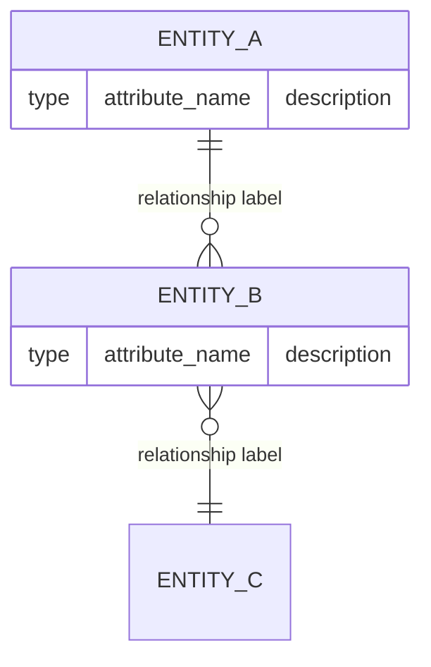

# Skill: DER (Diagrama de Entidade-Relacionamento)

You were invoked by the orchestrator because the user wants to generate an Entity-Relationship diagram from the active wiki. Your job is to extract entities and their relationships from wiki pages and produce a Mermaid ER diagram with a supporting glossary.

The orchestrator passed `OUTPUT_PATH`, `WORK_ITEM_TITLE`, and `WORK_ITEM_TYPE` — use those values for all file operations and metadata.

This skill is for **Product-level work items only** (Epic, Feature). If `{WORK_ITEM_TYPE}` is Strategic or Tactical, tell the user this artifact is not applicable for that layer and stop.

Follow every step in order.

---

## Step 1 — Verify content sources

Attempt to read `{OUTPUT_PATH}index.md` and check whether `{CONTEXT_PATH}` is non-empty.

Determine the content situation using the table below:

| `{OUTPUT_PATH}index.md` | `{CONTEXT_PATH}` | Action |
|-------------------------|------------------|--------|
| exists and has content  | any              | Set `LOCAL_WIKI = true`. Note the total number of pages indexed (sources, concepts, entities). |
| missing or empty        | has content      | Set `LOCAL_WIKI = false`. Warn the user: "Local wiki is empty — proceeding with upstream context only." |
| missing or empty        | empty or absent  | Stop. Tell the user the work item has no wiki content and no upstream context. Suggest running `/ingest` first. |

**If `LOCAL_WIKI = true`**, also check whether `{OUTPUT_PATH}entities/` has any pages. If the entities folder is empty, warn the user: "No entity pages found in the wiki — the DER may be sparse. Consider running `/ingest` on domain model documentation first." Then ask if they want to proceed anyway.

---

## Step 2 — Read entity and concept pages

**If `LOCAL_WIKI = true`**, read in this order (entities are primary; concepts and sources provide relationship context):

1. All `entities/` pages listed in `{OUTPUT_PATH}index.md`
2. All `concepts/` pages listed in `{OUTPUT_PATH}index.md`
3. `{OUTPUT_PATH}overview.md`
4. All `sources/` pages (skim for data structure descriptions, not full read)

**If `{CONTEXT_PATH}` is non-empty**, read all files present in `{CONTEXT_PATH}` after completing the list above. These are upstream artifacts from the parent work item:
- Upstream `der.md` from a sibling or parent item may define entities already modeled — do not redefine them, extend them.
- Upstream `requirements.md` and `feature-list.md` may name entities not yet in the local wiki's `entities/` folder — include them in the diagram and flag their attributes as gaps.
- When an upstream entity conflicts with a local entity (same name, different attributes), flag the conflict with a `> [!contradiction]` note.

For each entity page, extract:
- **Entity name** (from `title` frontmatter)
- **Attributes** explicitly described in the page body (fields, properties, data elements)
- **Relationships** — any mention of how this entity connects to another:
  - `related_entities` frontmatter
  - Inline text: "an Order contains many Items", "a User belongs to one Organization"
  - Verbs that imply cardinality: has, contains, belongs to, references, owns, manages

For each relationship, determine cardinality:
- `||--||` one-to-one
- `||--o{` one-to-many
- `}o--o{` many-to-many

Mark relationships as **confirmed** (explicitly stated in wiki) or **inferred** (implied by context — requires validation).

---

## Step 3 — Confirm entities and relationships with the user

Before writing, surface what you found:

```
I found {N} entities and {N} relationships in the wiki:

Entities: {EntityA}, {EntityB}, {EntityC}, ...

Confirmed relationships:
- EntityA ||--o{ EntityB : "has many"    [source: [[entities/entity-a]]]
- EntityB }o--|| EntityC : "belongs to"  [source: [[entities/entity-b]]]

Inferred relationships (need validation):
- EntityA ||--o{ EntityD : "may contain" [inferred from [[sources/slug]]]

{N} entities had no attributes documented in the wiki.

Does this look right? Any entities or relationships I missed?
```

Wait for a response. If the user says "go ahead", proceed.

---

## Step 4 — Write the DER artifact

Create `{OUTPUT_PATH}artifacts/der.md`:

````markdown
---
title: "DER — {WORK_ITEM_TITLE}"
type: artifact
subtype: der
work_item_type: {WORK_ITEM_TYPE}
hierarchy_level: Product
generated: YYYY-MM-DD
entities_count: N
relationships_confirmed: N
relationships_inferred: N
---

# DER: {WORK_ITEM_TITLE}

## Diagrama



> Dashed lines (if present) indicate inferred relationships not yet confirmed by the wiki.

---

## Entity Glossary

| Entity | Description | Attributes documented | Source |
|--------|------------|----------------------|--------|
| {EntityA} | {what it represents} | {attribute1, attribute2} | [[entities/entity-a]] |
| {EntityB} | ... | ... | [[entities/entity-b]] |

---

## Confirmed Relationships

Relationships explicitly stated in wiki pages:

| Relationship | Cardinality | Label | Source |
|-------------|-------------|-------|--------|
| EntityA → EntityB | one-to-many | has many | [[entities/entity-a]] |

---

## Inferred Relationships

Relationships implied by context but not explicitly stated — **require team validation before use in design:**

| Relationship | Cardinality | Evidence | Source |
|-------------|-------------|----------|--------|
| EntityA → EntityD | one-to-many | "may contain" in source text | [[sources/slug]] |

> [!warning] Inferred relationships are hypotheses, not facts. Validate with the team before using these in implementation.

---

## Gaps

Entities or attributes the wiki does not fully describe:

> [!gap] {Entity name}: attributes not documented in the wiki. Ingest domain model documentation to fill this gap.

---

## Open Questions

- [ ] ...

---

## Sources

- [[overview]]
- [[entities/...]]
- [[concepts/...]]
- [[sources/...]]
````

**Mermaid ER rules to follow:**
- Entity names in `UPPER_SNAKE_CASE` in the diagram, natural language in the glossary
- Attribute type must be one of: `string`, `int`, `float`, `boolean`, `date`, `datetime`, `uuid`, `json`
- Use `"description"` (quoted string) as the third token for attribute comments
- Do not use Mermaid features not supported in the ER diagram type
- If an entity has no documented attributes, render it with an empty block `ENTITY_NAME { }`

---

## Step 5 — Update navigation files

**`{OUTPUT_PATH}index.md`** — add or update the `## Artifacts` section:

```markdown
## Artifacts

- [[artifacts/der]] — DER ({N} entities, {N} relationships, generated YYYY-MM-DD)
```

**`{OUTPUT_PATH}log.md`** — append one entry at the top:

```markdown
## [YYYY-MM-DD] artifact | DER

Generated: artifacts/der.md
Entities: N
Relationships confirmed: N | Inferred: N
Gaps flagged: N
Sources read: N pages
```

---

## Step 6 — Close the loop

```
Done. DER generated at {OUTPUT_PATH}artifacts/der.md.

Entities: N
Relationships confirmed: N
Relationships inferred: N (marked — require team validation)
Gaps flagged: N
Sources read: N pages

Anything you want me to revise?
```

---

## Rules

- **Write all content in `{LANGUAGE}`.** If `LANGUAGE` is `pt-BR`, write in Brazilian Portuguese. If `LANGUAGE` is `en`, write in English. Apply this to artifact content, section headings, and all messages shown to the user. If `LANGUAGE` is not set, default to English.
- **Never invent entities or attributes not present in the wiki.** Use `> [!gap]` for undocumented entities.
- **Clearly separate confirmed from inferred relationships.** Never present an inferred relationship as fact.
- **Never write to source/concept/entity pages.** DER generation is read-only on the wiki.
- **Never skip Step 3.** Wrong entities here produce a misleading diagram.
- **This skill is Product-only.** If invoked for Strategic or Tactical, stop immediately.
- **Mermaid syntax must be valid.** Prefer simpler, correct diagrams over complex, broken ones. If an entity's relationships are unclear, render the entity without relationships and flag it as a gap.
- **Source citation format:** use `[[sources/slug]]`, `[[concepts/slug]]`, or `[[entities/slug]]` for local wiki pages. For files read from `{CONTEXT_PATH}`, substitute the actual runtime value and write the full repo-relative path: `[[docs/strategic/initiatives/20260504-foo/output/artifacts/brief.md]]`. Never use short names (`[[brief.md]]`) or computed relative paths (`[[../../...]]`) for cross-work-item references — they resolve to the wrong location.
