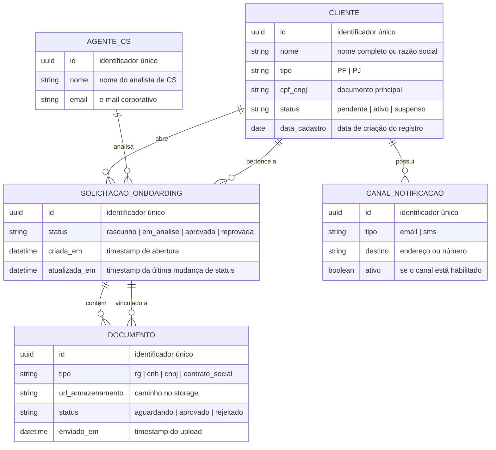

# DER: Portal de Autoatendimento

## Diagrama

## Entity Glossary

| Entidade | Descrição | Atributos documentados | Fonte |
|----------|-----------|----------------------|-------|
| CLIENTE | Pessoa física ou jurídica que inicia o onboarding | 6 | [[entities/cliente-pf]], [[entities/cliente-pj]] |
| SOLICITACAO_ONBOARDING | Processo de ativação de um novo cliente | 4 | [[entities/solicitacao-onboarding]] |
| DOCUMENTO | Arquivo enviado pelo cliente para validação | 5 | [[entities/documento]] |
| CANAL_NOTIFICACAO | Meio de comunicação (e-mail ou SMS) associado ao cliente | 4 | [[concepts/notificacoes]] |
| AGENTE_CS | Analista do time de Sucesso do Cliente responsável pela análise | 3 | [[entities/agente-cs]] |

## Confirmed Relationships

| Relacionamento | Cardinalidade | Rótulo | Fonte |
|----------------|--------------|--------|-------|
| CLIENTE → SOLICITACAO_ONBOARDING | um-para-muitos | "abre" | [[entities/solicitacao-onboarding]] |
| SOLICITACAO_ONBOARDING → DOCUMENTO | um-para-muitos | "contém" | [[entities/documento]] |
| CLIENTE → CANAL_NOTIFICACAO | um-para-muitos | "possui" | [[concepts/notificacoes]] |
| AGENTE_CS → SOLICITACAO_ONBOARDING | um-para-muitos | "analisa" | [[sources/pesquisa-jornada-cliente]] |
| SOLICITACAO_ONBOARDING → CLIENTE | muitos-para-um | "pertence a" | [[entities/solicitacao-onboarding]] |
| DOCUMENTO → SOLICITACAO_ONBOARDING | muitos-para-um | "vinculado a" | [[entities/documento]] |

## Inferred Relationships

| Relacionamento | Cardinalidade | Evidência | Fonte |
|----------------|--------------|-----------|-------|
| DOCUMENTO → AGENTE_CS | muitos-para-um | "documentos são revisados individualmente por um agente" — implícito no fluxo descrito | [[sources/pesquisa-jornada-cliente]] |
| CLIENTE → AGENTE_CS | muitos-para-um | "cada cliente tem um CS responsável" — mencionado em entrevistas mas não modelado | [[sources/pesquisa-jornada-cliente]] |

## Gaps

> [!gap] A entidade `CANAL_NOTIFICACAO` não tem atributos de preferência (ex.: horário preferido, frequência máxima). A wiki descreve notificações como requisito mas não detalha o modelo de dados. Confirmar com o time de produto antes de implementar.

> [!gap] Não há entidade de `HISTORICO_STATUS` documentada na wiki. Se a rastreabilidade de mudanças de status for requisito de compliance, incluir na próxima iteração do DER.

## Open Questions

- [ ] Um cliente PJ com múltiplos sócios gera uma `SOLICITACAO_ONBOARDING` por sócio ou uma única solicitação?
- [ ] `DOCUMENTO` precisa guardar versões (reenvio após rejeição) ou apenas o estado atual?

## Sources

- [[overview]]
- [[entities/cliente-pf]]
- [[entities/cliente-pj]]
- [[entities/solicitacao-onboarding]]
- [[entities/documento]]
- [[entities/agente-cs]]
- [[concepts/notificacoes]]
- [[sources/pesquisa-jornada-cliente]]
