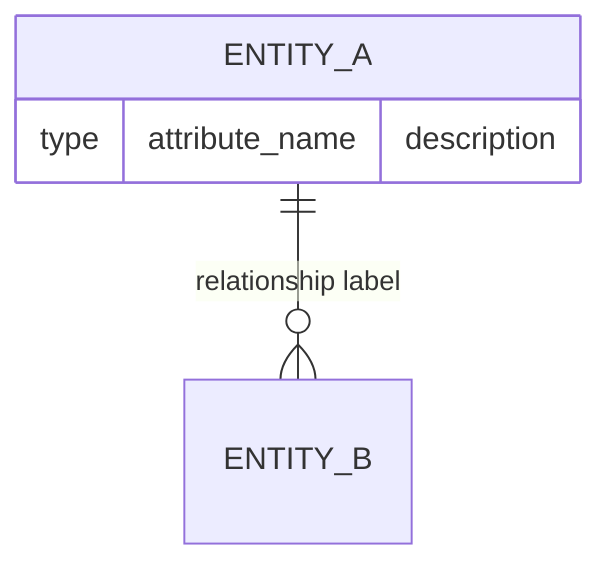

# DER: {WORK_ITEM_TITLE}

## Diagrama

## Entity Glossary

| Entity | Description | Attributes documented | Source |
|--------|------------|----------------------|--------|
| ... | ... | ... | [[entities/...]] |

## Confirmed Relationships

| Relationship | Cardinality | Label | Source |
|-------------|-------------|-------|--------|
| ... | ... | ... | [[entities/...]] |

## Inferred Relationships

| Relationship | Cardinality | Evidence | Source |
|-------------|-------------|----------|--------|
| ... | ... | ... | [[sources/...]] |

## Gaps

> [!gap] ...

## Open Questions

- [ ] ...

## Sources

- [[overview]]
- [[entities/...]]
- [[concepts/...]]
- [[sources/...]]
