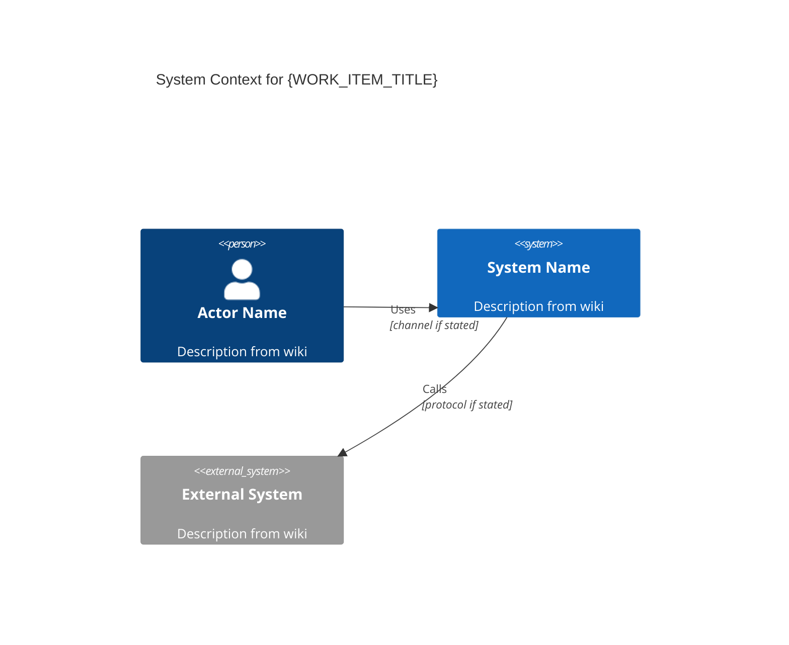
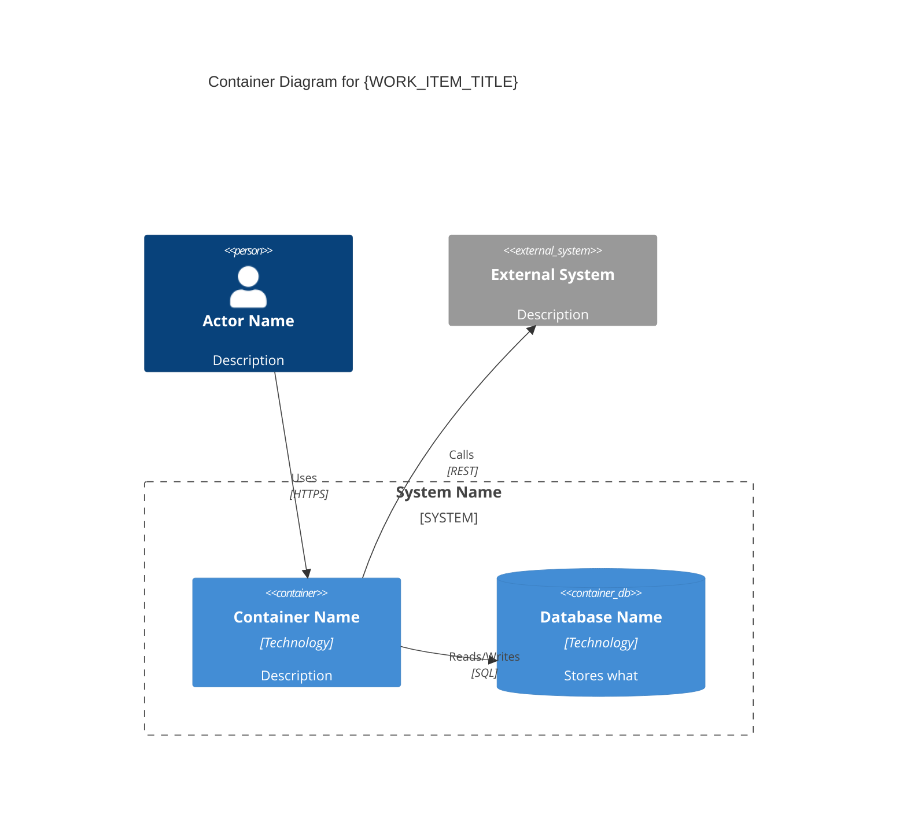
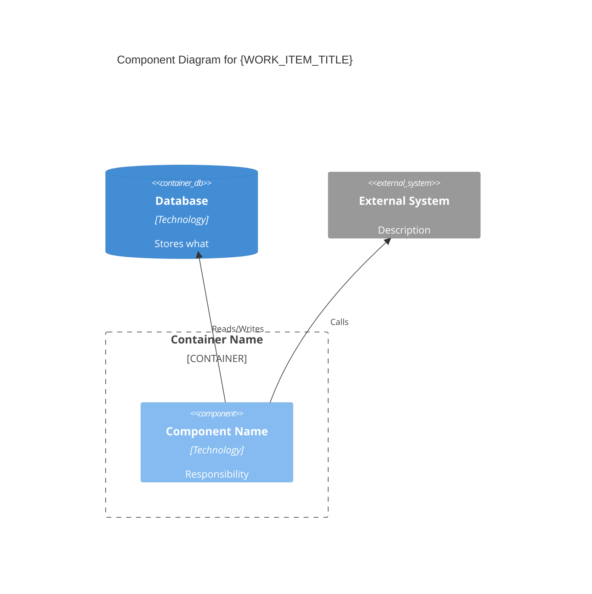
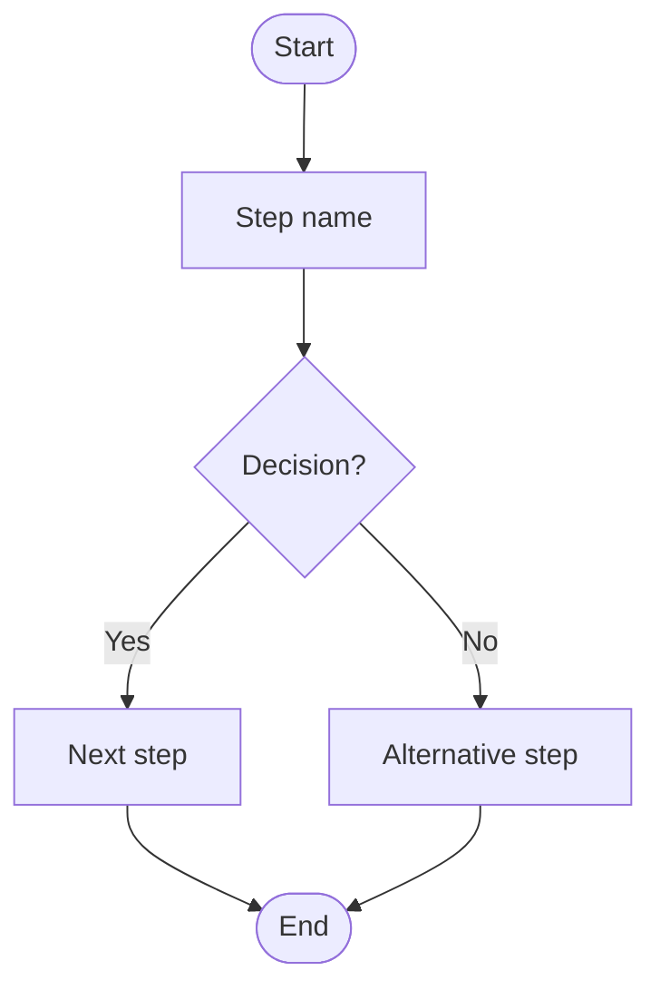
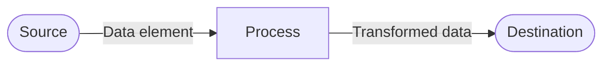
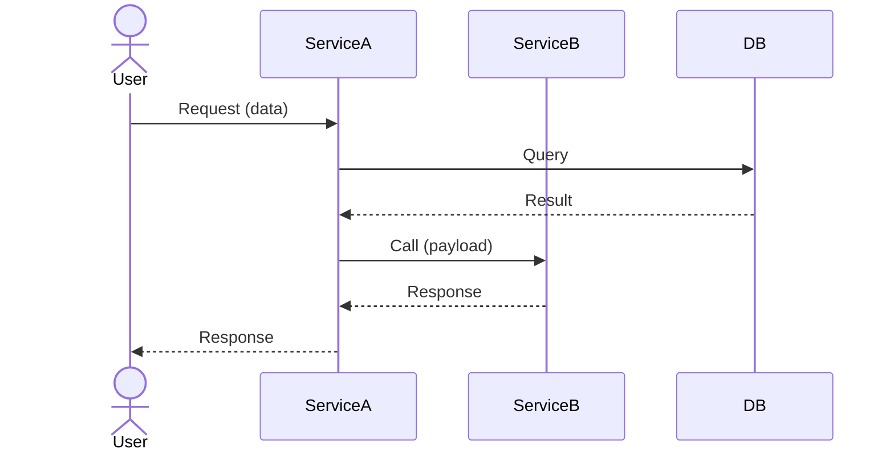
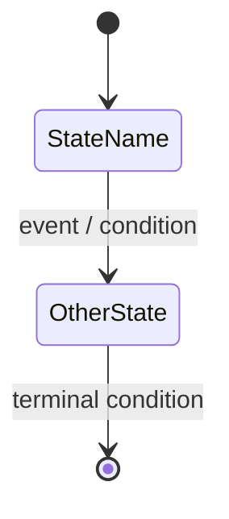

# Skill: Diagram

You were invoked by the orchestrator because the user wants to generate a diagram from the active wiki. Your job is to extract structural or behavioral information from the wiki and produce a valid Mermaid diagram with a supporting glossary.

The orchestrator passed `OUTPUT_PATH`, `WORK_ITEM_TITLE`, `WORK_ITEM_TYPE`, and `WORK_ITEM_HIERARCHY_LEVEL` — use those values for all file operations and metadata.

Follow every step in order.

---

## Step 1 — Verify wiki has content

Read `{OUTPUT_PATH}index.md`.

- If the file does not exist or is empty, stop. Tell the user the wiki has no content yet and suggest running `/ingest` first.
- Note the total number of pages indexed.

---

## Step 2 — Select diagram type

Present the menu that corresponds to `{WORK_ITEM_HIERARCHY_LEVEL}`:

**Strategic:**
```
Which diagram do you want to generate?
  1. C4 Level 1 — System Context  (the system and its external actors/systems)
  2. C4 Level 2 — Container       (containers: apps, services, databases inside the system)
```

**Product:**
```
Which diagram do you want to generate?
  1. C4 Level 3 — Component  (components inside a specific container)
  2. Process Flow            (steps in a business or user process)
  3. Data Flow               (how data moves between system parts)
```

**Tactical:**
```
Which diagram do you want to generate?
  1. Sequence  (interactions between actors/components over time)
  2. State     (states and transitions of an entity or process)
```

Wait for the user's selection. Record it as `{DIAGRAM_TYPE}`. Do not proceed until a type is chosen.

---

## Step 3 — Read wiki pages for the selected type

Read pages according to what each diagram type needs:

| Diagram type | Primary pages to read | Secondary |
|---|---|---|
| C4 L1 System Context | `overview.md`, all `entities/` | `sources/` for system boundaries |
| C4 L2 Container | `overview.md`, all `entities/`, all `concepts/` | `sources/` for tech stack mentions |
| C4 L3 Component | all `entities/`, all `concepts/` | `overview.md`, `sources/` |
| Process Flow | `overview.md`, all `sources/` | `concepts/` for rules |
| Data Flow | all `entities/`, all `concepts/` | `sources/` for integration points |
| Sequence | all `sources/`, all `concepts/` | `entities/` for actor names |
| State | `concepts/` pages about the entity's lifecycle | `sources/` for transition rules |

**If `{CONTEXT_PATH}` is non-empty**, read all files present in `{CONTEXT_PATH}` after completing the list above. These are upstream artifacts from the parent work item:
- Upstream `diagrams/` files (especially C4 L1/L2) define the system boundary and external actors — a C4 L3 or flow diagram must stay consistent with that boundary.
- Upstream `der.md` provides the canonical entity model — use those entity names verbatim in sequence and state diagrams.
- Upstream `feature-list.md` scopes which flows or components are relevant for this work item.

While reading, extract the elements specific to the chosen type:

**C4 diagrams — extract:**
- Systems, containers, or components named in the wiki
- External actors (users, external services, third parties)
- Relationships and data flows between elements
- Technology labels (language, framework, protocol) if stated
- Boundary groupings (which elements belong together)

**Process Flow — extract:**
- Steps or actions described in sequence
- Decision points (conditions that fork the flow)
- Actors or roles responsible for each step
- Start and end states

**Data Flow — extract:**
- Data elements or entities that move between parts
- Source and destination of each data movement
- Transformation steps if described
- External systems involved

**Sequence — extract:**
- Participants (actors, systems, components)
- Messages exchanged in chronological order
- Synchronous vs asynchronous interactions (if stated)
- Return values or responses
- Loops or conditional blocks described in sources

**State — extract:**
- States the entity can be in
- Events or conditions that trigger transitions
- Entry/exit actions for states (if described)
- Terminal and initial states

---

## Step 4 — Confirm diagram elements with the user

Before writing, surface what you found:

```
For a {DIAGRAM_TYPE} diagram, I identified:

Elements ({N} total):
- {element name} — {type: system | container | actor | step | state | participant}
- ...

Relationships / transitions ({N}):
- {A} → {B} : "{label}"
- ...

{N} elements had insufficient wiki coverage (will be flagged as gaps).

Does this look right? Anything to add, rename, or remove?
```

Wait for a response. If the user says "go ahead", proceed.

---

## Step 5 — Write the diagram artifact

Create `{OUTPUT_PATH}artifacts/diagrams/{diagram-type-slug}.md`.

Use the Mermaid syntax block for the selected type. See the templates below.

---

### C4 Level 1 — System Context

````markdown
---
title: "C4 L1 System Context — {WORK_ITEM_TITLE}"
type: artifact
subtype: diagram
diagram_type: c4-context
hierarchy_level: Strategic
generated: YYYY-MM-DD
---

# C4 Level 1: System Context — {WORK_ITEM_TITLE}

## Diagram



## Elements

| Element | Type | Description | Source |
|---------|------|------------|--------|
| {name} | Person / System / External | {description} | [[entities/slug]] |

## Relationships

| From | To | Label | Source |
|------|----|-------|--------|
| {A} | {B} | {label} | [[sources/slug]] |

## Gaps

> [!gap] {Element or relationship not covered by the wiki}

## Sources

- [[overview]]
- [[entities/...]]
- [[sources/...]]
````

---

### C4 Level 2 — Container

````markdown
---
title: "C4 L2 Container — {WORK_ITEM_TITLE}"
type: artifact
subtype: diagram
diagram_type: c4-container
hierarchy_level: Strategic
generated: YYYY-MM-DD
---

# C4 Level 2: Container — {WORK_ITEM_TITLE}

## Diagram



## Elements

| Element | Type | Technology | Description | Source |
|---------|------|-----------|------------|--------|
| {name} | Container / Database / Queue | {tech or "not stated"} | {desc} | [[entities/slug]] |

## Relationships

| From | To | Label | Protocol | Source |
|------|----|-------|---------|--------|

## Gaps

> [!gap] {Element without sufficient wiki coverage}

## Sources
````

---

### C4 Level 3 — Component

````markdown
---
title: "C4 L3 Component — {WORK_ITEM_TITLE}"
type: artifact
subtype: diagram
diagram_type: c4-component
hierarchy_level: Product
generated: YYYY-MM-DD
---

# C4 Level 3: Component — {WORK_ITEM_TITLE}

## Diagram



## Elements

| Component | Technology | Responsibility | Source |
|-----------|-----------|---------------|--------|

## Relationships

| From | To | Label | Source |
|------|----|-------|--------|

## Gaps

## Sources
````

---

### Process Flow

````markdown
---
title: "Process Flow — {WORK_ITEM_TITLE}"
type: artifact
subtype: diagram
diagram_type: process-flow
hierarchy_level: Product
generated: YYYY-MM-DD
---

# Process Flow: {WORK_ITEM_TITLE}

## Diagram



## Steps

| Step | Actor / System | Description | Source |
|------|---------------|------------|--------|

## Decision Points

| Decision | Condition | Branches | Source |
|---------|-----------|---------|--------|

## Gaps

## Sources
````

---

### Data Flow

````markdown
---
title: "Data Flow — {WORK_ITEM_TITLE}"
type: artifact
subtype: diagram
diagram_type: data-flow
hierarchy_level: Product
generated: YYYY-MM-DD
---

# Data Flow: {WORK_ITEM_TITLE}

## Diagram



## Data Elements

| Data element | From | To | Transformation | Source |
|-------------|------|----|---------------|--------|

## Gaps

## Sources
````

---

### Sequence Diagram

````markdown
---
title: "Sequence Diagram — {WORK_ITEM_TITLE}"
type: artifact
subtype: diagram
diagram_type: sequence
hierarchy_level: Tactical
generated: YYYY-MM-DD
---

# Sequence Diagram: {WORK_ITEM_TITLE}

## Diagram



## Participants

| Participant | Type | Description | Source |
|------------|------|------------|--------|

## Messages

| # | From | To | Message | Sync/Async | Source |
|---|------|----|---------|-----------|--------|

## Gaps

## Sources
````

---

### State Diagram

````markdown
---
title: "State Diagram — {WORK_ITEM_TITLE}"
type: artifact
subtype: diagram
diagram_type: state
hierarchy_level: Tactical
generated: YYYY-MM-DD
---

# State Diagram: {WORK_ITEM_TITLE}

## Diagram



## States

| State | Description | Source |
|-------|------------|--------|

## Transitions

| From | To | Trigger | Guard condition | Source |
|------|----|---------|----------------|--------|

## Gaps

## Sources
````

---

## Step 6 — Update navigation files

**`{OUTPUT_PATH}index.md`** — add or update the `## Artifacts` section:

```markdown
## Artifacts

- [[artifacts/diagrams/{diagram-type-slug}]] — {Diagram type} (generated YYYY-MM-DD)
```

**`{OUTPUT_PATH}log.md`** — append one entry at the top:

```markdown
## [YYYY-MM-DD] artifact | Diagram ({diagram type})

Generated: artifacts/diagrams/{diagram-type-slug}.md
Elements: N
Relationships: N
Gaps flagged: N
Sources read: N pages
```

---

## Step 7 — Close the loop

```
Done. {Diagram type} diagram generated at {OUTPUT_PATH}artifacts/diagrams/{slug}.md.

Elements: N
Relationships: N
Gaps flagged: N (elements without wiki coverage)
Sources read: N pages

Anything you want me to revise?
```

---

## Rules

- **Write all content in `{LANGUAGE}`.** If `LANGUAGE` is `pt-BR`, write in Brazilian Portuguese. If `LANGUAGE` is `en`, write in English. Apply this to artifact content, section headings, and all messages shown to the user. If `LANGUAGE` is not set, default to English.
- **Never invent elements not present in the wiki.** Use `> [!gap]` for anything the wiki does not cover.
- **Mermaid syntax must be valid.** Test mentally before writing — prefer a simpler correct diagram over a complex broken one.
- **Never merge distinct elements** to make the diagram smaller. One system = one node; one container = one node.
- **Never modify source/concept/entity pages.** Diagram generation is read-only on the wiki.
- **Never skip Step 2.** The diagram type must be explicitly selected — do not guess.
- **Never skip Step 4.** Wrong elements produce a misleading diagram that will be harder to correct than to prevent.
- **Technology labels come only from the wiki.** If the wiki does not state the technology, use `"not stated"` in the diagram element description.
- **One artifact file per diagram type.** If the user wants both a C4 L1 and a C4 L2, run the skill twice.
