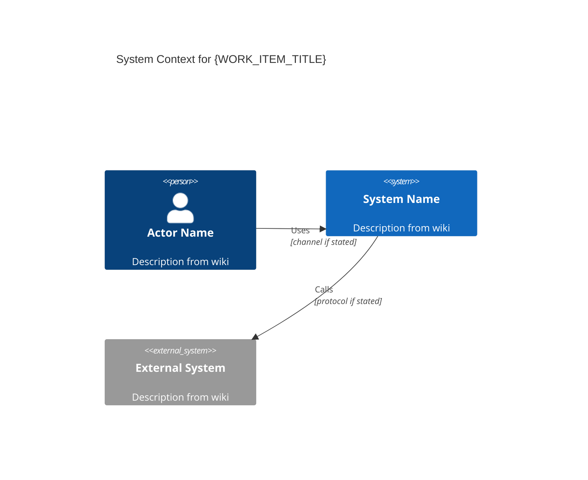
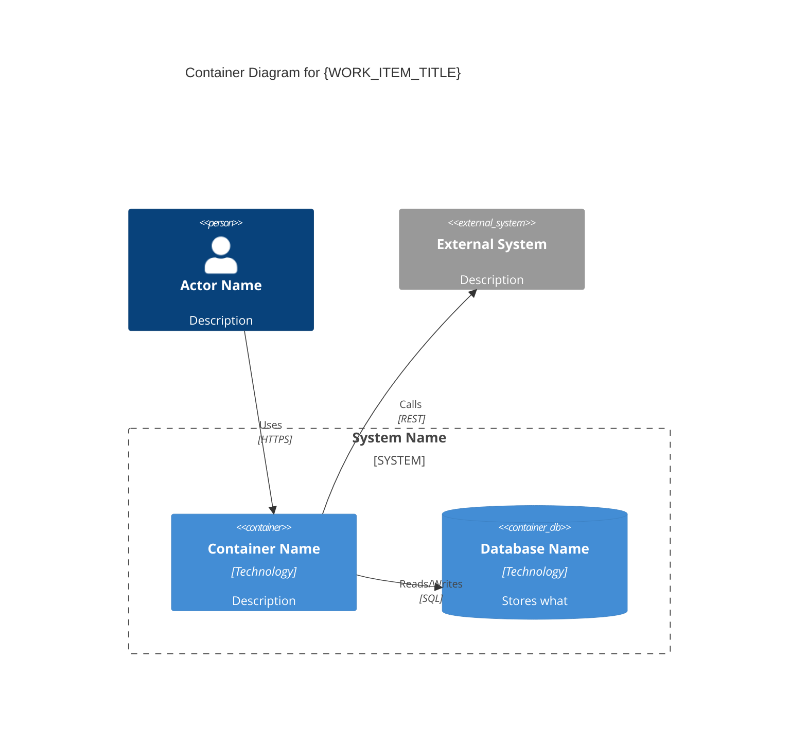
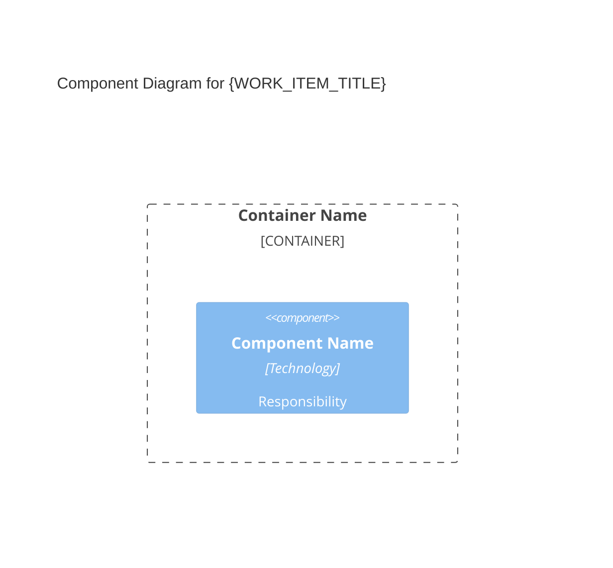
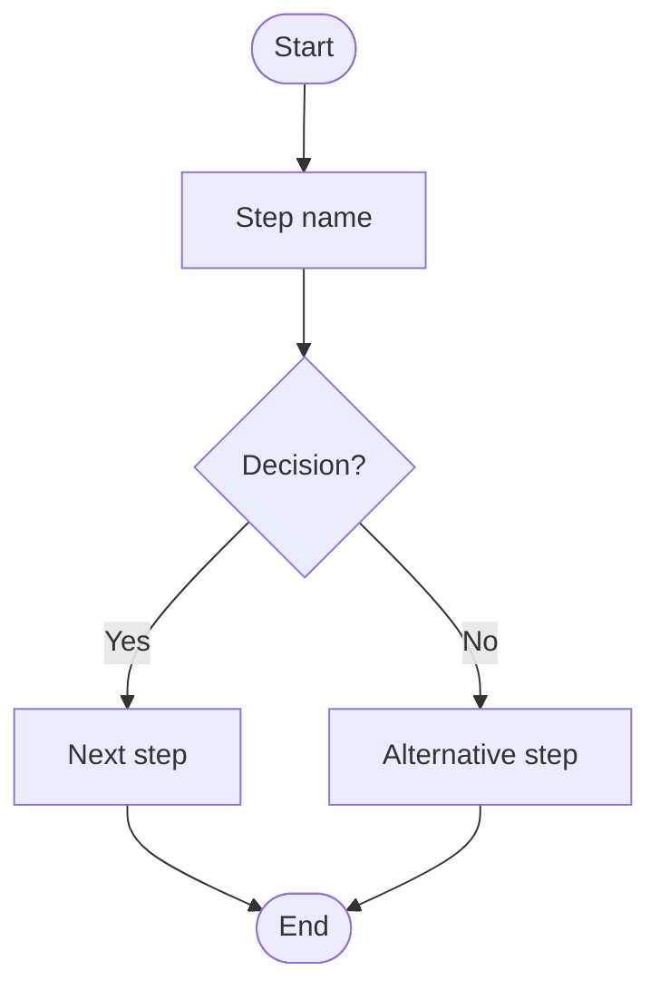
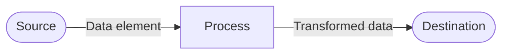
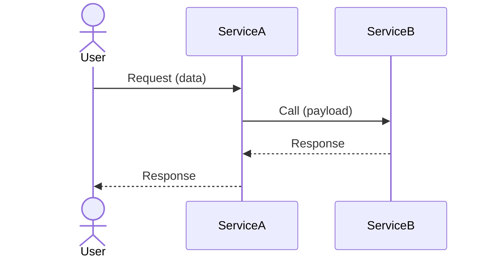
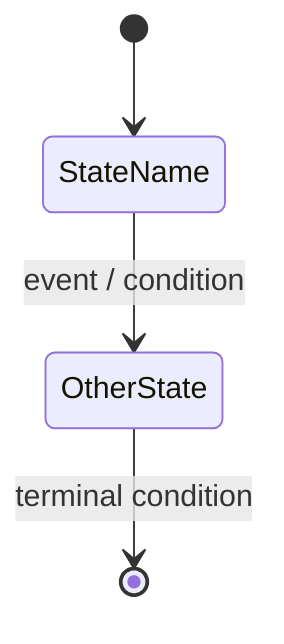

# Diagram Templates

Use the matching section below for `{DIAGRAM_TYPE}`.

## c4-context

````markdown
---
title: "C4 L1 System Context — {WORK_ITEM_TITLE}"
type: artifact
subtype: diagram
diagram_type: c4-context
hierarchy_level: Strategic
generated: YYYY-MM-DD
---

# C4 Level 1: System Context — {WORK_ITEM_TITLE}

## Diagram


````

## c4-container

````markdown
---
title: "C4 L2 Container — {WORK_ITEM_TITLE}"
type: artifact
subtype: diagram
diagram_type: c4-container
hierarchy_level: Strategic
generated: YYYY-MM-DD
---

# C4 Level 2: Container — {WORK_ITEM_TITLE}

## Diagram


````

## c4-component

````markdown
---
title: "C4 L3 Component — {WORK_ITEM_TITLE}"
type: artifact
subtype: diagram
diagram_type: c4-component
hierarchy_level: Product
generated: YYYY-MM-DD
---

# C4 Level 3: Component — {WORK_ITEM_TITLE}

## Diagram


````

## process-flow

````markdown
---
title: "Process Flow — {WORK_ITEM_TITLE}"
type: artifact
subtype: diagram
diagram_type: process-flow
hierarchy_level: Product
generated: YYYY-MM-DD
---

# Process Flow: {WORK_ITEM_TITLE}

## Diagram


````

## data-flow

````markdown
---
title: "Data Flow — {WORK_ITEM_TITLE}"
type: artifact
subtype: diagram
diagram_type: data-flow
hierarchy_level: Product
generated: YYYY-MM-DD
---

# Data Flow: {WORK_ITEM_TITLE}

## Diagram


````

## sequence

````markdown
---
title: "Sequence Diagram — {WORK_ITEM_TITLE}"
type: artifact
subtype: diagram
diagram_type: sequence
hierarchy_level: Tactical
generated: YYYY-MM-DD
---

# Sequence Diagram: {WORK_ITEM_TITLE}

## Diagram


````

## state

````markdown
---
title: "State Diagram — {WORK_ITEM_TITLE}"
type: artifact
subtype: diagram
diagram_type: state
hierarchy_level: Tactical
generated: YYYY-MM-DD
---

# State Diagram: {WORK_ITEM_TITLE}

## Diagram


````
