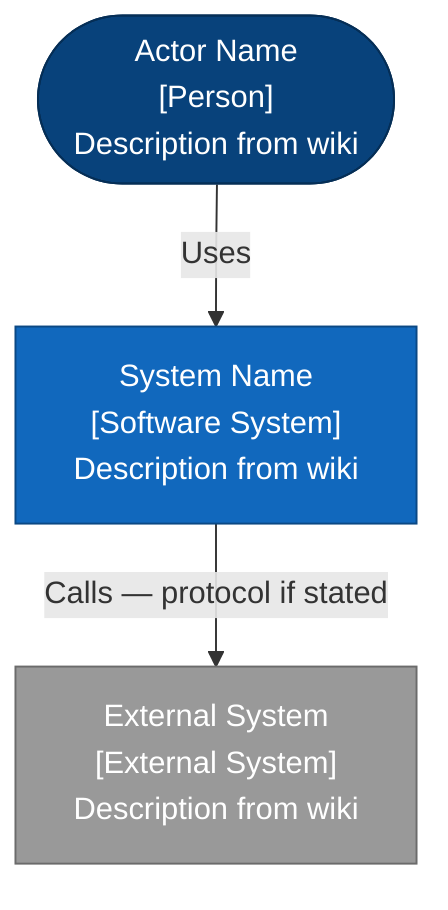
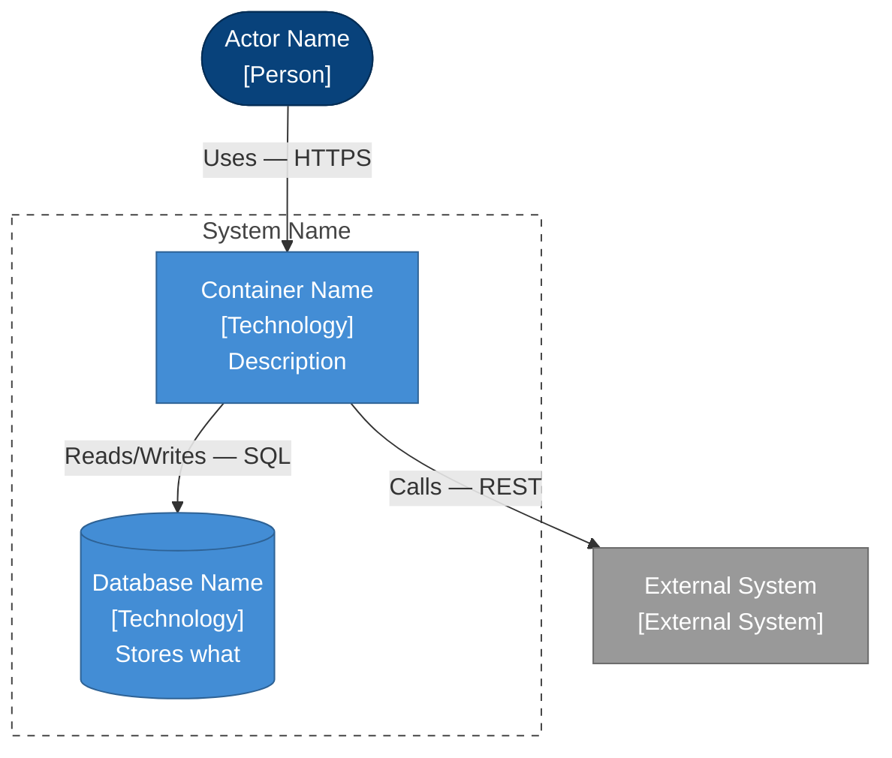
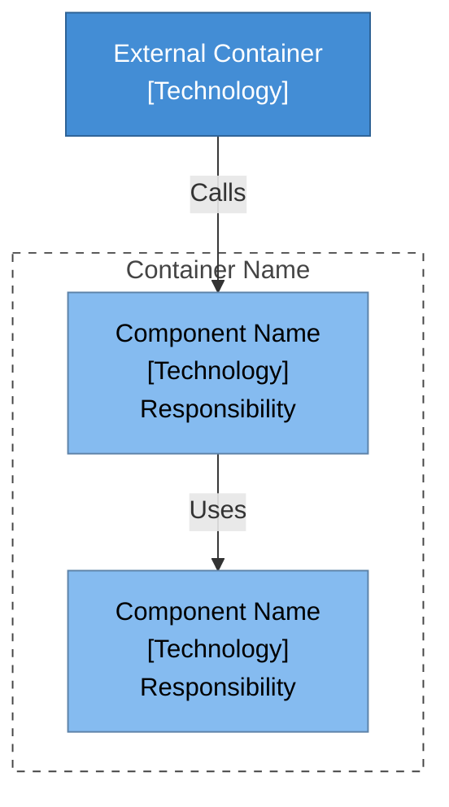
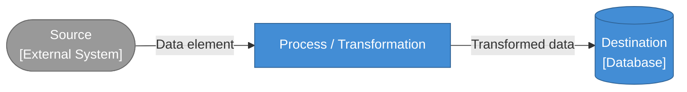
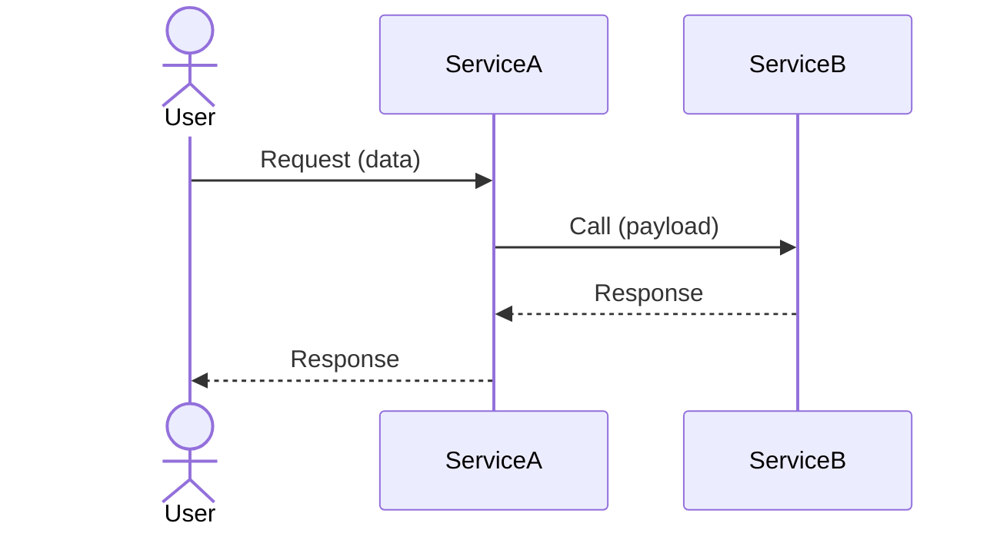
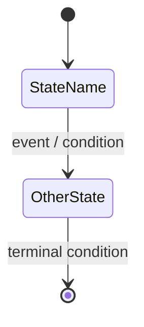

# Diagram Templates

Use the matching section below for `{DIAGRAM_TYPE}`.

---

> **C4Model color conventions** — include the relevant `classDef` lines in every flowchart diagram:
>
> | Class | Element | Fill |
> |---|---|---|
> | `person` | Human actors / users | `#08427B` (dark blue) |
> | `system` | Internal software systems | `#1168BD` (blue) |
> | `external` | External systems / third parties | `#999999` (gray) |
> | `container` | Apps, services, queues inside a system | `#438DD5` (medium blue) |
> | `database` | Databases / storage | `#438DD5` (medium blue) |
> | `component` | Components inside a container | `#85BBF0` (light blue, dark text) |
> | `step` | Process steps | `#438DD5` (medium blue) |
> | `decision` | Decision / branch nodes | `#85BBF0` (light blue, dark text) |
> | `terminal` | Start / end nodes | `#1168BD` (blue) |

---

## c4-context

````markdown
---
title: "C4 L1 System Context — {WORK_ITEM_TITLE}"
type: artifact
subtype: diagram
diagram_type: c4-context
hierarchy_level: Strategic
generated: YYYY-MM-DD
---

# C4 Level 1: System Context — {WORK_ITEM_TITLE}

## Diagram


````

## c4-container

````markdown
---
title: "C4 L2 Container — {WORK_ITEM_TITLE}"
type: artifact
subtype: diagram
diagram_type: c4-container
hierarchy_level: Strategic
generated: YYYY-MM-DD
---

# C4 Level 2: Container — {WORK_ITEM_TITLE}

## Diagram


````

## c4-component

````markdown
---
title: "C4 L3 Component — {WORK_ITEM_TITLE}"
type: artifact
subtype: diagram
diagram_type: c4-component
hierarchy_level: Product
generated: YYYY-MM-DD
---

# C4 Level 3: Component — {WORK_ITEM_TITLE}

## Diagram


````

## process-flow

````markdown
---
title: "Process Flow — {WORK_ITEM_TITLE}"
type: artifact
subtype: diagram
diagram_type: process-flow
hierarchy_level: Product
generated: YYYY-MM-DD
---

# Process Flow: {WORK_ITEM_TITLE}

## Diagram

```mermaid
flowchart TD
    classDef terminal  fill:#1168BD,color:#ffffff,stroke:#0B4884
    classDef step      fill:#438DD5,color:#ffffff,stroke:#2E6295
    classDef decision  fill:#85BBF0,color:#000000,stroke:#5D82A8

    START([Start]):::terminal --> STEP1[Step name]:::step
    STEP1 --> DEC1{Decision?}:::decision
    DEC1 -->|Yes| STEP2[Next step]:::step
    DEC1 -->|No|  STEP3[Alternative step]:::step
    STEP2 --> END([End]):::terminal
    STEP3 --> END
```
````

## data-flow

````markdown
---
title: "Data Flow — {WORK_ITEM_TITLE}"
type: artifact
subtype: diagram
diagram_type: data-flow
hierarchy_level: Product
generated: YYYY-MM-DD
---

# Data Flow: {WORK_ITEM_TITLE}

## Diagram


````

## sequence

````markdown
---
title: "Sequence Diagram — {WORK_ITEM_TITLE}"
type: artifact
subtype: diagram
diagram_type: sequence
hierarchy_level: Tactical
generated: YYYY-MM-DD
---

# Sequence Diagram: {WORK_ITEM_TITLE}

## Diagram


````

## state

````markdown
---
title: "State Diagram — {WORK_ITEM_TITLE}"
type: artifact
subtype: diagram
diagram_type: state
hierarchy_level: Tactical
generated: YYYY-MM-DD
---

# State Diagram: {WORK_ITEM_TITLE}

## Diagram


````
