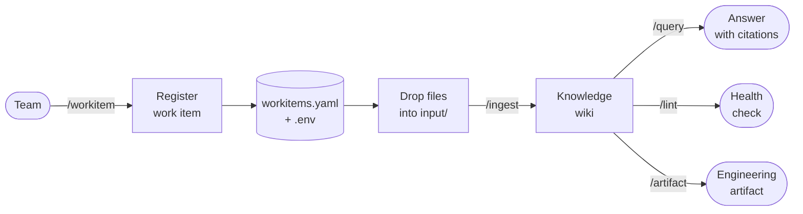

    

> An AI-assisted knowledge and artifact pipeline for engineering teams — traceable from source document to shipped user story.

**manifast** is an AI plugin for **Claude Code** and **VS Code** that turns a plain git repository into a structured knowledge base and artifact generation pipeline. Teams register work items, drop source documents (specs, meeting notes, PDFs, emails) into a folder, and the plugin ingests them into cross-linked wiki pages — then generates software engineering artifacts that build progressively on each other: briefs, quality attributes & constraints, ADRs, feature lists, diagrams, and user stories.

Every artifact traces back to a source document. Every decision can be explained.

The work item hierarchy mirrors what teams already use in Jira, Azure DevOps, and SAFe — **Strategic** (Themes, Initiatives), **Product** (Epics, Features), and **Tactical** (User Stories, Tasks, Bugs). Artifacts generated at the strategic level automatically propagate as constraints into product-level work; product artifacts flow into tactical ones. The knowledge travels with the hierarchy.

## How it works

1. **Register** a work item — creates the folder structure and tracks the active item in `.env`.
2. **Drop** source files into `input/` (Markdown, PDF, plain text, images).
3. **Ingest** — the plugin reads each source, discusses key takeaways with you, then writes structured wiki pages into `output/`.
4. **Query** — ask questions; every answer cites a wiki page, which traces back to a source file.
5. **Generate artifacts** — produce briefs, quality attributes & constraints, ADRs, feature lists, diagrams, and user stories directly from the wiki. Each artifact enriches the next.
6. **Lint** — periodic health check that finds orphan pages, broken links, contradictions, and stale content.

---

## Guides

| Guide | Description |
|---|---|
| [How To: Quick Start](HOW_TO.md) | All commands in order — the full end-to-end sequence |
| [How To: Work Items](HOW_TO_WORKITEMS.md) | Create and select work items; understanding the hierarchy |
| [How To: Artifacts](HOW_TO_ARTIFACTS.md) | Generate briefs, requirements, ADRs, diagrams, and user stories |
| [Full Documentation](WIKI.md) | Deep-dive reference for every command, skill, and concept |

---

## References

- [LLM Wiki](https://gist.github.com/karpathy/442a6bf555914893e9891c11519de94f) — Andrej Karpathy. The foundational concept behind manifast: instead of re-deriving knowledge on every query (RAG), an LLM incrementally maintains a persistent wiki that accumulates cross-references and syntheses over time. The wiki is the compounding artifact between raw sources and the user.
- [Scaled Agile Framework — Big Picture](https://framework.scaledagile.com/#big-picture) — Scaled Agile, Inc. The work item hierarchy that manifast mirrors: Strategic (Themes, Initiatives), Product (Epics, Features), and Tactical (User Stories, Tasks) — the same structure used by teams in Jira, Azure DevOps, and SAFe programs.
- [Software traceability: trends and future directions](https://dl.acm.org/doi/10.1145/2593882.2593891) — Cleland-Huang et al., FOSE 2014. The academic grounding for manifast's core promise: every artifact must be traceable back to its source. This paper surveys traceability as a first-class engineering concern, not an afterthought.

---

## License

MIT — see [LICENSE](LICENSE).
