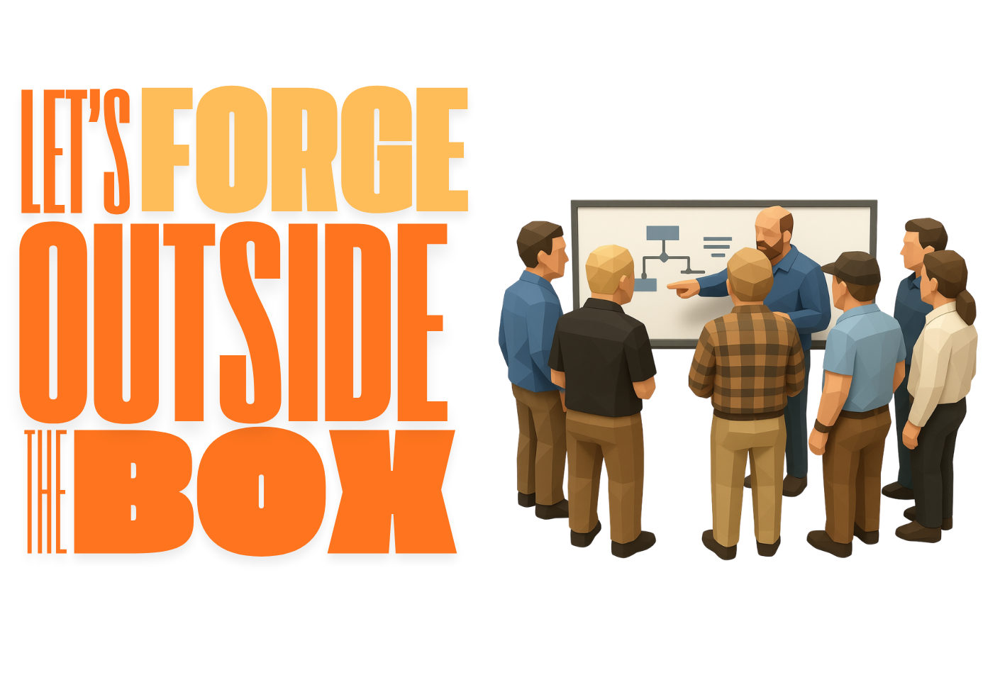
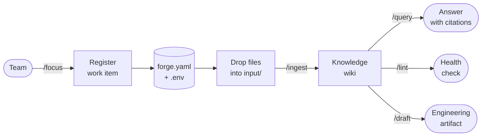

    

> An AI-assisted knowledge and artifact pipeline for engineering teams — traceable from source document to shipped user story.

**forge** is an AI plugin for **Claude Code** and **VS Code** that turns a plain git repository into a structured knowledge base and artifact generation pipeline. Teams register work items, drop source documents (specs, meeting notes, PDFs, emails) into a folder, and the plugin ingests them into cross-linked wiki pages — then generates software engineering artifacts that build progressively on each other: briefs, quality attributes & constraints, ADRs, feature lists, diagrams, and user stories.

Every artifact traces back to a source document. Every decision can be explained.

The work item hierarchy mirrors what teams already use in Jira, Azure DevOps, and SAFe — **Strategic** (Themes, Initiatives), **Product** (Epics, Features), and **Tactical** (User Stories, Tasks, Bugs). Artifacts generated at the strategic level automatically propagate as constraints into product-level work; product artifacts flow into tactical ones. The knowledge travels with the hierarchy.

## How it works

1. **Register** a work item — creates the folder structure and tracks the active item in `.env`. 
     - See [How To: Create Work Items](HOW_TO_WORKITEMS.md) for details on the work item hierarchy and best practices.
2. **Drop** source files into `input/` (Markdown, PDF, plain text, images).
     - See [How To: Ingest a Source](HOW_TO_WIKI.md#ingest--adding-a-source) for a walkthrough of the ingestion process and how to guide the AI's understanding.
3. **Query** — ask questions; every answer cites a wiki page, which traces back to a source file.
    - See [How To: Answer Questions](HOW_TO_WIKI.md#query--answering-questions) for tips on crafting effective queries and interpreting citations.
4. **Generate artifacts** — produce briefs, quality attributes & constraints, ADRs, feature lists, feature details, diagrams, and user stories directly from the wiki. Each artifact enriches the next: the Epic's `feature-list` feeds the Feature's `feature-detail`, which feeds individual `user-story` files at Tactical level.
     - See [How To: Generate Artifacts](HOW_TO_ARTIFACTS.md) for a step-by-step guide to generating each artifact type and how they build on each other.
5. **Lint** — periodic health check that finds orphan pages, broken links, contradictions, and stale content.

---

## Guides

| Guide | Description |
|---|---|
| [How To: Create Work Items](HOW_TO_WORKITEMS.md) | Create and select work items; understanding the hierarchy |
| [How To: Create and Maintain a Wiki](HOW_TO_WIKI.md) | Ingest sources, query the wiki, and run health checks |
| [How To: Generate Artifacts](HOW_TO_ARTIFACTS.md) | Generate briefs, requirements, ADRs, diagrams, and user stories |
| [Research & Documentation](RESEARCH.md) | Deep-dive reference for every command, skill, and concept |

---

## References

- [SPReaD: Service-oriented Process for Reengineering and DevOps](https://link.springer.com/article/10.1007/s11761-021-00329-x) — da Silva, Justino & Adachi, SOCA 2022. The academic origin of forge: a structured process for migrating legacy systems to microservices integrating DevOps, establishing the principle that software engineering activities must follow traceable, repeatable steps with defined artifacts and quality checkpoints.
- [protocolo-es-ai](https://github.com/yanjustino/protocolo-es-ai) — Yan Justino. The direct predecessor of forge: a protocol for adopting LLMs across the software development cycle, organized across Framework, Process, and AI-Enabled Activities layers. Validated in a real transformation scenario at a major Brazilian bank. forge is its tooling realization.
- [LLM Wiki](https://gist.github.com/karpathy/442a6bf555914893e9891c11519de94f) — Andrej Karpathy. The foundational concept behind forge: instead of re-deriving knowledge on every query (RAG), an LLM incrementally maintains a persistent wiki that accumulates cross-references and syntheses over time. The wiki is the compounding artifact between raw sources and the user.
- [Scaled Agile Framework — Big Picture](https://framework.scaledagile.com/#big-picture) — Scaled Agile, Inc. The work item hierarchy that forge mirrors: Strategic (Themes, Initiatives), Product (Epics, Features), and Tactical (User Stories, Tasks) — the same structure used by teams in Jira, Azure DevOps, and SAFe programs.
- [Software traceability: trends and future directions](https://dl.acm.org/doi/10.1145/2593882.2593891) — Cleland-Huang et al., FOSE 2014. The academic grounding for forge's core promise: every artifact must be traceable back to its source. This paper surveys traceability as a first-class engineering concern, not an afterthought.

---

## Author

**forge** was created by **[Yan Justino](https://www.linkedin.com/in/yanjustino/)** — Staff Software Engineer at Banco Itaú and researcher at CESAR School.

The framework is the convergence of two parallel tracks: academic research into structured software engineering processes and hands-on experience leading large-scale modernization efforts in the Brazilian financial industry.

On the research side, Yan's work spans legacy system reengineering, service-oriented architecture, and DevOps process design — published at ICSE (2018), SOCA (2021–2022), and IEEE (2022). The theoretical foundation of forge — that software engineering activities must follow traceable, repeatable steps with defined artifacts and quality checkpoints — comes directly from the [SPReaD](https://link.springer.com/article/10.1007/s11761-021-00329-x) methodology (da Silva, Justino & Adachi, SOCA 2022), a process framework for migrating legacy systems to microservices that was validated in production at a major Brazilian bank.

On the industry side, forge grew out of [protocolo-es-ai](https://github.com/yanjustino/protocolo-es-ai) — a protocol for structuring LLM adoption across the full software development lifecycle, designed and applied during real transformation programs at Itaú Unibanco. Where the protocol defined the what and why, forge is the tooling realization: the how.

> The idea that an LLM should maintain a persistent, compounding wiki — rather than re-derive knowledge on every query — is the architectural principle that made forge possible. Academic rigour gave it structure. Industry reality gave it scope.

---

## License

MIT — see [LICENSE](LICENSE).
