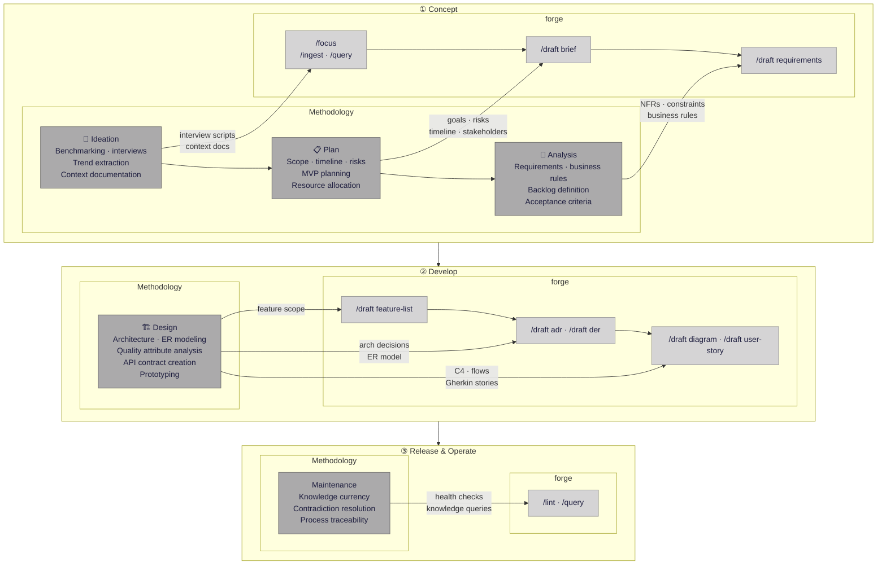
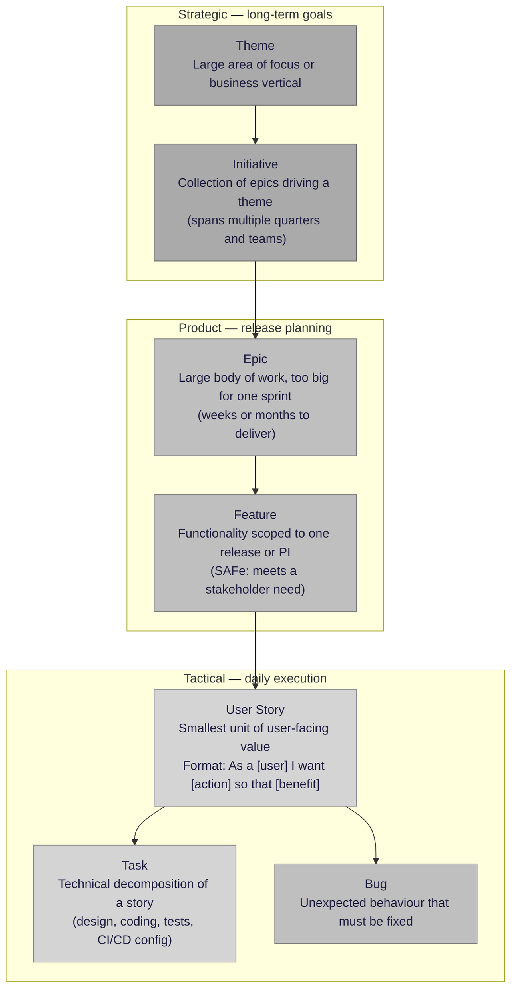
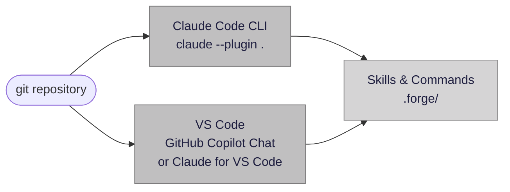
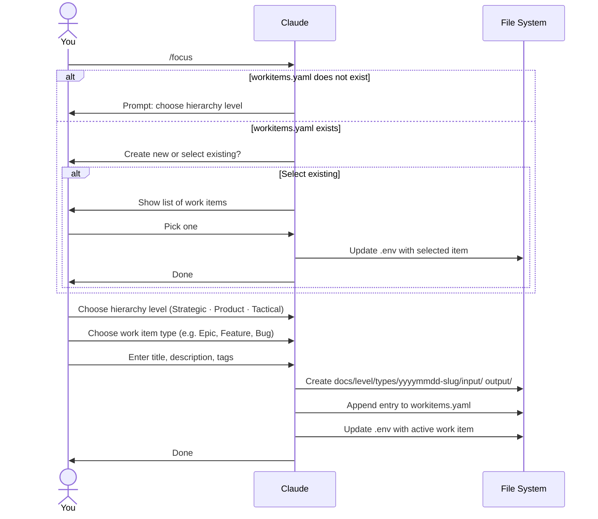
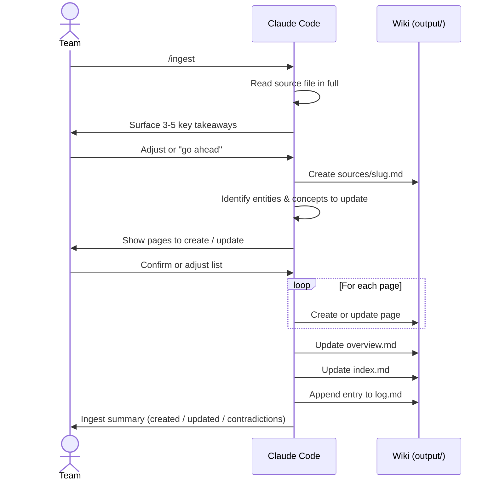
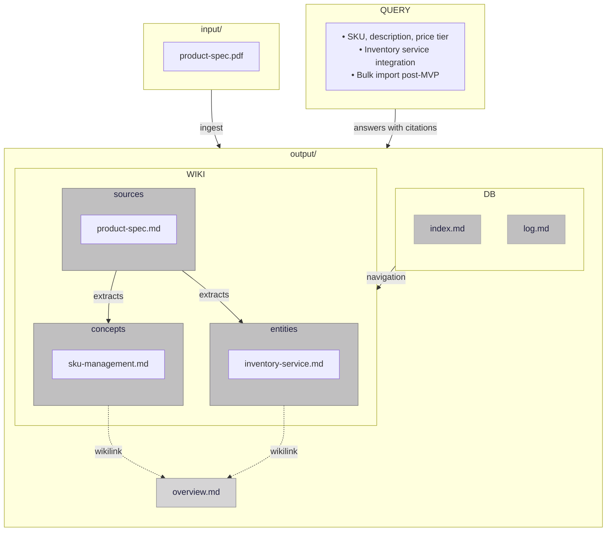
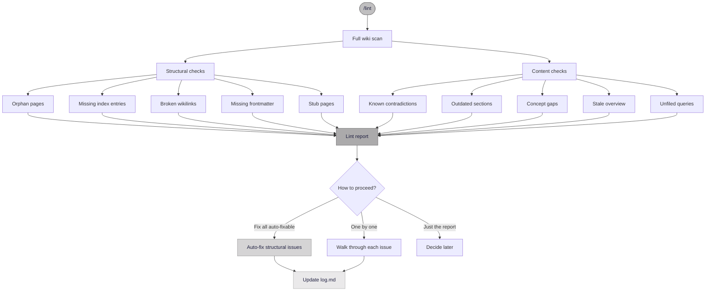
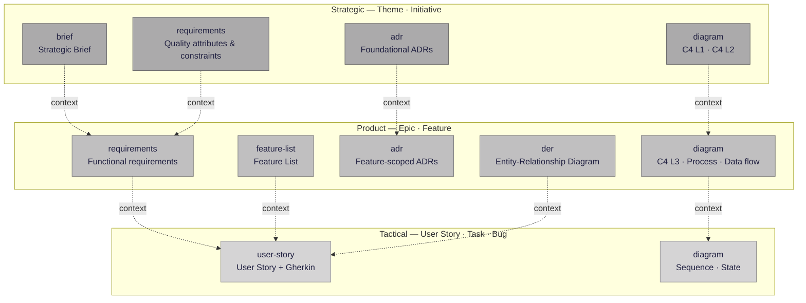
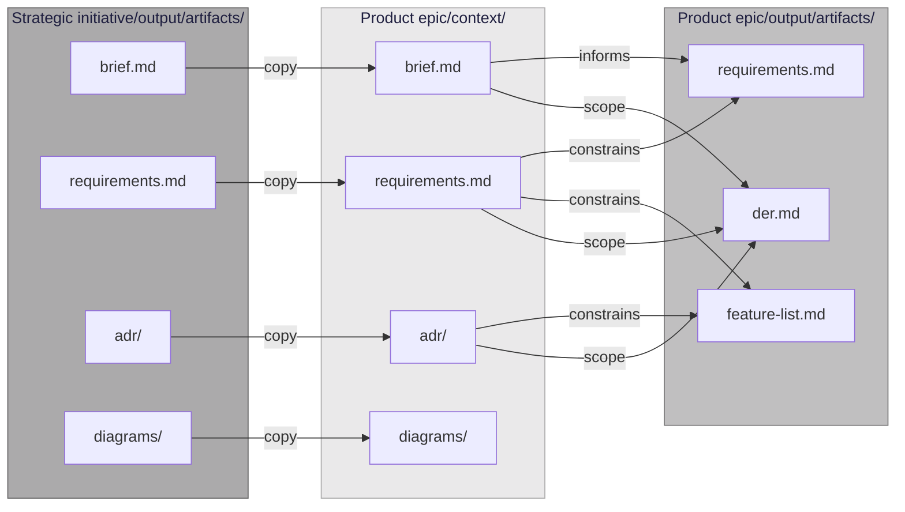

# Forge Documentation

- [Origins](#origins)
- [Agile-friendly by design](#agile-friendly-by-design)
- [Requirements](#requirements)
- [Installation](#installation)
- [Step-by-step: Registering a work item](#step-by-step-registering-a-work-item)
- [Step-by-step: Ingesting knowledge](#step-by-step-ingesting-knowledge)
- [Querying the wiki](#querying-the-wiki)
- [Maintaining wiki health](#maintaining-wiki-health)
- [Generating artifacts](#generating-artifacts)

## Origins

forge did not emerge from scratch. It is the tooling realization of a research lineage that began in academic work and evolved through a practical engineering protocol.

**2021 — SPReaD (Springer)**

The foundation is [SPReaD: Service-oriented Process for Reengineering and DevOps](https://link.springer.com/article/10.1007/s11761-021-00329-x) (da Silva, Justino & Adachi, SOCA 2022). SPReaD defined a structured process for migrating legacy systems to microservice architectures, integrating DevOps practices throughout — establishing the principle that software engineering activities should follow a traceable, repeatable process with defined steps, artifacts, and quality checkpoints.

**2025 — protocolo-es-ai**

SPReaD's process orientation was extended to the AI-assisted development era in [protocolo-es-ai](https://github.com/yanjustino/protocolo-es-ai) — a protocol for adopting LLMs across the software development cycle. Organized across three levels (Framework, Process, AI-Enabled Activities), it defined structured guidelines and evaluation metrics for AI use in activities such as requirement extraction, user story generation, architecture diagramming, and API contract creation. The protocol was validated in a real digital transformation scenario at a major Brazilian bank.

**2026 — forge**

forge operationalizes the protocolo-es-ai as a running tool. Where the protocol defines *what* AI-assisted engineering activities should look like, forge provides the commands, skills, and wiki infrastructure that make those activities executable inside a standard git repository and editor. The work item hierarchy, the ingest-query-artifact pipeline, and the traceability chain from source document to shipped artifact are all direct implementations of the process model established in the protocol — which itself inherits the structured, artifact-driven approach of SPReaD.

```
SPReaD (Springer, 2021)        → structured process for SE + DevOps
        ↓
protocolo-es-ai (2023)         → protocol for LLM adoption in SE activities
        ↓
forge                       → tooling that runs the protocol inside your editor
```

### Protocol → forge mapping

The diagram maps each methodological activity of the protocolo-es-ai to the forge commands that implement it. Protocol activities are shown in dark grey; forge commands in light grey.



---

## Agile-friendly by design

Agility is not about moving fast — it is about delivering **value continuously and adaptably**. forge organizes knowledge around the same work item hierarchy that engineering teams already use in their day-to-day workflow.



This structure matters for three reasons:

| Principle | How it applies |
|---|---|
| **Risk reduction** | Breaking work from Epic → Story reduces complexity and uncertainty before coding starts |
| **Traceability** | An engineer writing a database migration can trace it back to the Epic and Theme it serves |
| **Continuous delivery** | Small, well-defined stories enable smaller commits, faster code reviews, and safer deploys |

---

## Requirements

Choose the environment that fits your workflow:



| Environment | Requirement |
|---|---|
| Claude Code | [Claude Code CLI](https://github.com/anthropics/claude-code) installed and authenticated |
| VS Code | [GitHub Copilot](https://marketplace.visualstudio.com/items?itemName=GitHub.copilot-chat) or [Claude for VS Code](https://marketplace.visualstudio.com/items?itemName=Anthropic.claude-code) extension |
| Both | Git repository (`git init` if starting from scratch) |

---

## Installation

```bash
git clone https://github.com/cooperacode/manifesto.git
cd manifesto
```

**Claude Code** picks up the plugin automatically from `.claude-plugin/plugin.json` when you open the folder.

**VS Code** reads `.vscode/settings.json`, which registers the commands and skills with the chat agent:

```json
{
  "chat.promptFilesLocations":  { ".forge/commands": true },
  "chat.agentSkillsLocations":  { ".forge/skills":   true }
}
```

No extra configuration needed — open the folder and the `/focus`, `/ingest`, `/query`, and `/lint` commands appear in the chat panel.

---

## Step-by-step: Registering a work item

Work items map to the three-level agile hierarchy described in [Agile-friendly by design](#agile-friendly-by-design):

| Level | Types | Scope |
|---|---|---|
| Strategic | Theme, Initiative | Business goals, multi-quarter efforts |
| Product | Epic, Feature | Release planning, PI increments |
| Tactical | User Story, Task, Bug | Sprint execution, daily engineering work |

### 1. Open the repository in your editor

**Claude Code:**
```bash
claude --plugin .
```

**VS Code:** open the folder — commands load automatically via `.vscode/settings.json`.

### 2. Run the `/focus` command

```
/focus
```

Claude will ask what you want to do:

```
What action would you like to perform?
  ▸ Create a new work item
    Select an existing work item
```

### 3. Follow the registration flow



### 4. What gets created

```
docs/
  product/
    features/
      20260502-feature-name/
        input/    ← place source files here
        output/   ← local wiki index, log, and generated artifacts
```

The item is appended to `docs/forge.yaml` and `.env` is updated:

```env
FORGE_TITLE=feature-name
FORGE_TAGS=[tag1, tag2]
FORGE_LEVEL=Product
FORGE_TYPE=Feature
FORGE_PATH=docs/product/features/20260502-feature-name/
FORGE_PARENT=docs/strategic/initiatives/20260503-parent-initiative
FORGE_LANG=en
```

If `forge.yaml` already has entries, `/focus` lets you pick one from the list instead. Selecting an item updates `.env` so subsequent commands target the correct folders.

---

## Step-by-step: Ingesting knowledge

### 1. Drop source files into `input/`

Place any documents relevant to the active work item inside its `input/` folder:

```
docs/product/features/20260502-feature-name/input/
  ├── product-spec.pdf
  ├── competitor-analysis.md
  └── stakeholder-notes.txt
```

Supported formats: Markdown, plain text, PDF, and images (charts, screenshots, diagrams).

### 2. Run the `ingest` skill and follow the flow



### 3. Review key takeaways

Before writing anything, Claude surfaces 3–5 bullet points:

```
Key takeaways from "product-spec.pdf":
• Cadastro de produtos requires SKU, description, and at least one price tier.
• Integration with the existing inventory service is mandatory for MVP.
• Bulk import via CSV is a post-MVP requirement.

Is there anything you want emphasized or ignored?
Does this contradict anything already in the wiki?
```

Respond to guide the ingest, or say **"go ahead"** to proceed with Claude's judgment.

### 4. Wiki structure after ingest



Claude writes into `output/`:

```
output/
  sources/product-spec.md          <- summary, key claims, quotes
  concepts/sku-management.md       <- new concept extracted
  entities/inventory-service.md    <- entity mentioned in the source
  overview.md                      <- updated synthesis
  index.md                         <- navigation index
  log.md                           <- audit trail
```

### 5. Ingest summary

```
Done. Ingested "product-spec.pdf".

Created: sources/product-spec, concepts/sku-management
Updated: entities/inventory-service, overview
Flagged: 0 contradictions

Anything you want me to revisit?
```

---

## Querying the wiki

Ask any question about the ingested knowledge:

```
/query What are the MVP requirements for cadastro de produtos?
```

Every claim cites a wiki page. Gaps and contradictions are surfaced explicitly rather than filled from model memory. After answering, Claude offers to save the response as a new wiki page — useful for preserving synthesis that doesn't yet have a home.

---

## Maintaining wiki health

```
/lint
```



Scans the wiki for orphan pages, broken wikilinks, missing frontmatter, stale content, and contradictions. Auto-fixes structural issues; presents content issues for your review.

---

## Generating artifacts

Once knowledge is ingested into the wiki, `/draft` synthesizes it into structured software engineering documents. The orchestrator reads the active work item from `.env`, determines the hierarchy level, and routes to the correct skill.

```
/draft [type]
```

Omit the type to see the menu for the active level. Pass a type to skip the menu. See the full list in [Artifact skills — by hierarchy level](#artifact-skills--by-hierarchy-level).

### Artifacts by hierarchy level



Dashed arrows show **upstream context** — artifacts from a parent work item that are read directly from the parent's `output/artifacts/` folder when the skill runs.

### Recommended generation order within a work item

```
brief → requirements → feature-list → adr → der → diagram → user-story → diagram (seq/state)
```

Each artifact that exists enriches the next one. `feature-list` is a hard dependency for `user-story`; all others are soft (enrich if present, not required).

### Artifact output location

All artifacts are written to `{work-item-path}/output/artifacts/`:

```
output/
  artifacts/
    brief.md
    requirements.md
    feature-list.md
    der.md
    adr/
      index.md
      001-decision-title.md
    diagrams/
      c4-context.md
      process-flow.md
    user-story.md
```

`index.md` and `log.md` in `output/` are updated automatically after each artifact is generated.

---

## Cross-work-item context

Work items form a hierarchy. When a Product Epic is linked to a Strategic Initiative, the Initiative's artifacts act as guardrails for the Epic's artifact generation.

### Linking a parent during registration

When creating a work item with `/focus`, step 1.3b presents a list of valid parent candidates from `workitems.yaml`. Selecting one stores the relationship:

```yaml
# docs/forge.yaml
items:
  - title: initiative-title
    hierarchyLevel: Strategic
    path: docs/strategic/initiatives/20260503-initiative-title
    parent: ""

  - title: epic-name
    hierarchyLevel: Product
    path: docs/product/epics/20260510-epic-name
    parent: docs/strategic/initiatives/20260503-initiative-title   ← linked
```

### What gets propagated



Before invoking any skill, the orchestrator resolves `CONTEXT_PATH` pointing directly to the parent's `output/artifacts/` folder. Skills read from it on demand — nothing is copied. Upstream artifacts take precedence over inferences from local sources when there is a conflict.

If the parent has no published artifacts yet, the orchestrator warns:

```
No artifacts found in parent work item.
Run /draft on the parent first to generate upstream context.
```

---

## Skills reference

### Wiki commands

| Command      | Purpose                                               |
|--------------|-------------------------------------------------------|
| `/lang`  | Set the language for artifacts and interactions (`en`, `pt-BR`) |
| `/focus`  | Register or select a work item (supports parent linking) |
| `/ingest`    | Add source documents to the wiki                     |
| `/query`     | Answer questions from wiki content with citations    |
| `/lint`      | Find and fix structural and content problems         |
| `/draft`  | Generate an engineering artifact from wiki knowledge |

### Artifact skills — by hierarchy level

| Level      | Artifact type   | Output file(s)                          |
|------------|----------------|-----------------------------------------|
| Strategic  | `brief`        | `artifacts/brief.md`                    |
| Strategic  | `requirements` | `artifacts/requirements.md` — quality attributes & constraints |
| Strategic  | `adr`          | `artifacts/adr/NNN-title.md` + index    |
| Strategic  | `diagram`      | `artifacts/diagrams/<type>.md`          |
| Product    | `requirements` | `artifacts/requirements.md` — functional requirements |
| Product    | `der`          | `artifacts/der.md`                      |
| Product    | `adr`          | `artifacts/adr/NNN-title.md` + index    |
| Product    | `feature-list` | `artifacts/feature-list.md`             |
| Product    | `diagram`      | `artifacts/diagrams/<type>.md`          |
| Tactical   | `user-story`   | `artifacts/user-story.md`               |
| Tactical   | `diagram`      | `artifacts/diagrams/<type>.md`          |
